# SkillUP

## Project Description

**SkillUP** is an educational platform that enables users to create, consume, and rate educational content. The platform is built using **NodeJS**, **MongoDB**, and **ExpressJS**.

The application follows a monolithic architecture, with the backend built using Node.js and Express.js, and MongoDB serving as the primary database.

### Key Features

- **User Authentication and Authorization:**
  - Students and instructors can sign up and log in to the platform using their email addresses and passwords.
  - The platform supports OTP (One-Time Password) verification and forgot password functionality for added security.

- **Course Management:**
  - Instructors can create, read, update, and delete courses.

- **Cloud-based Media Management:**
  - SkillUP uses Cloudinary, a cloud-based media management service, to store and manage all media content, including images, videos, and documents.

### Database

The database is built using MongoDB, a NoSQL database that provides flexible and scalable data storage. MongoDB is suitable for storing unstructured and semi-structured data. The database stores course content, user data, and other relevant information related to the platform.

## Screenshots

### OTP Operations

- `POST /api/auth/verify-otp`: Verify OTP sent to the user's email.
  
  #### OTP Create
  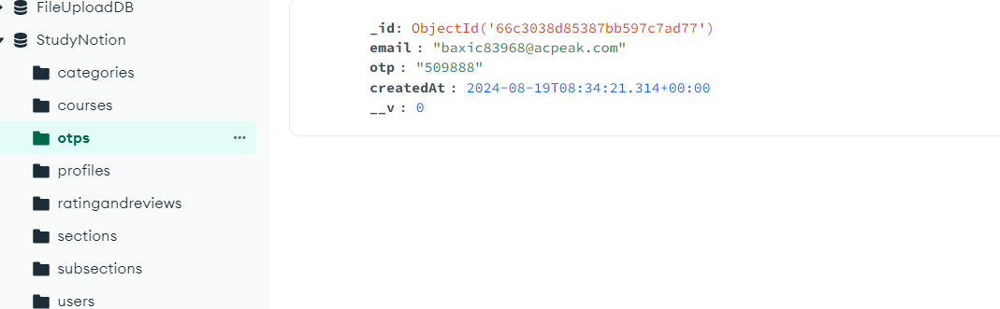
  
  #### OTP Email Sent
  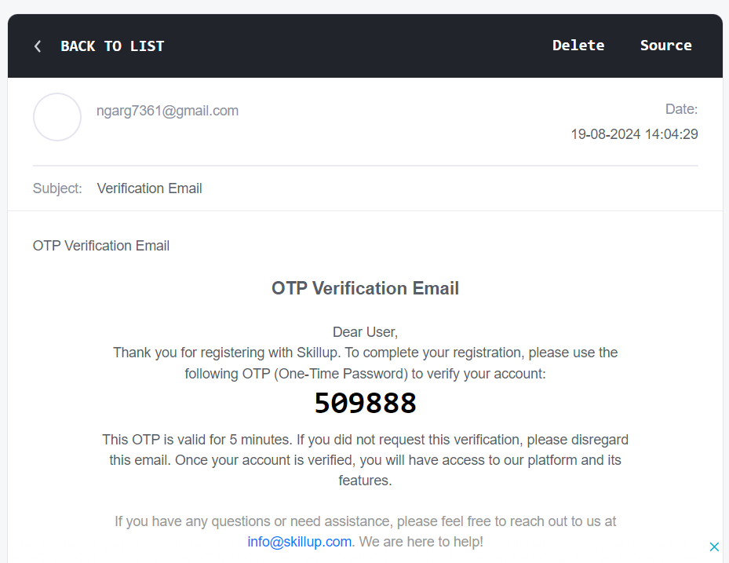
  
  #### OTP Postman
  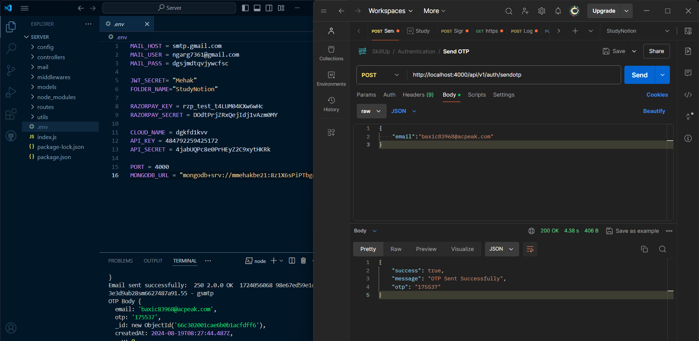

### User Management

- `POST /api/auth/signup`: Create a new user account.
  
  #### Sign Up
  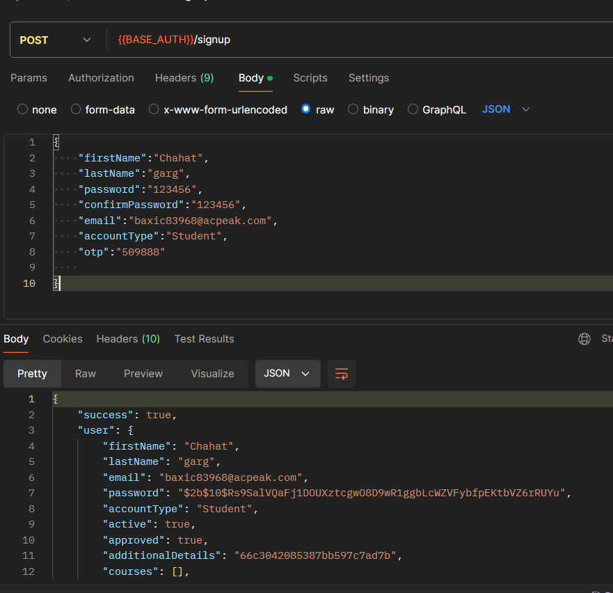
  
  #### User
  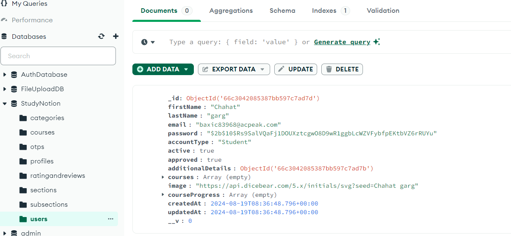
  
- `POST /api/auth/login`: Log in and generate a JWT token.
  
  #### Log In
  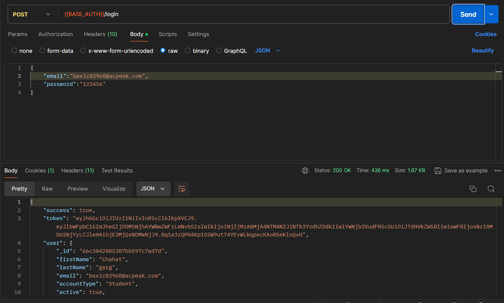
  
  #### Token
  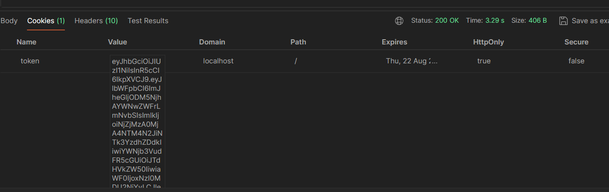

- `POST /api/auth/reset-password`: Reset user password.
  
  #### Reset Password
  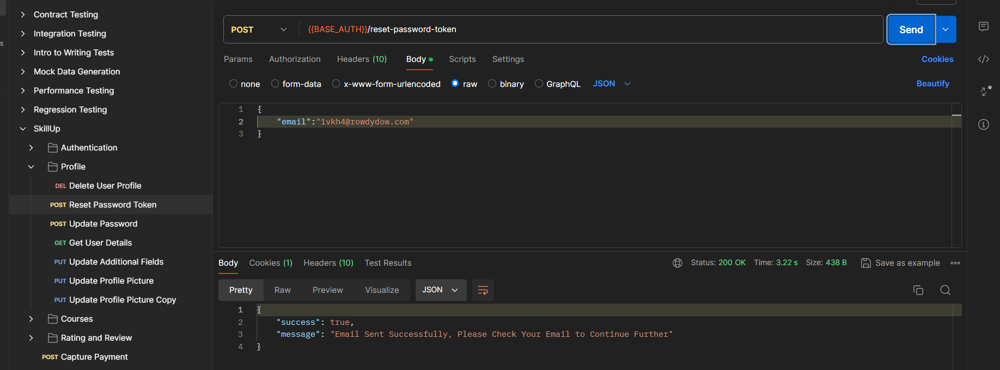
  
  #### Reset Email
  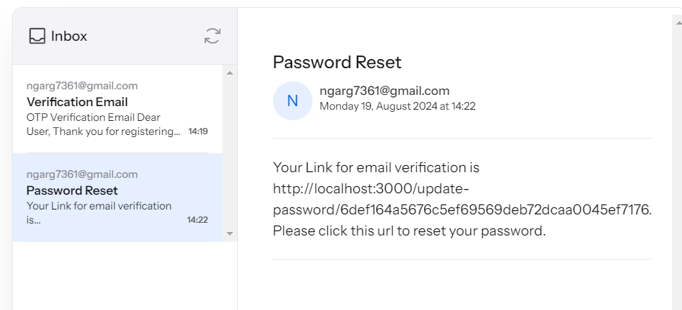
  
  #### User Entry
  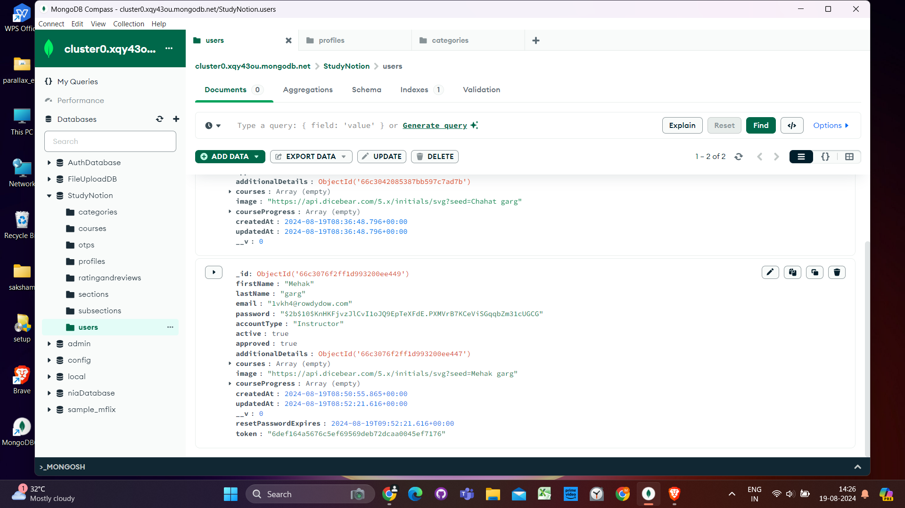

### Course Management

- `POST /api/courses`: Create a new course.
  
  #### Category
  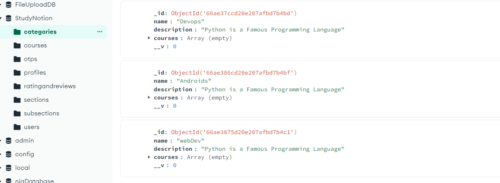
  
  #### Courses
  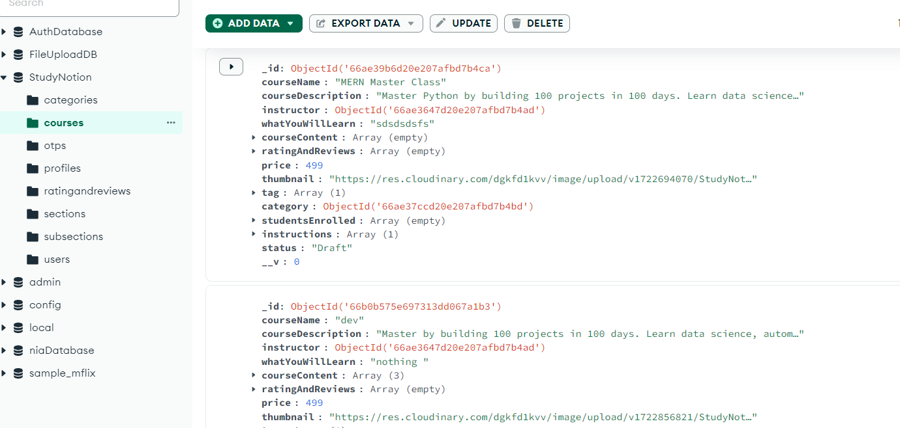
  
  #### Subsection
  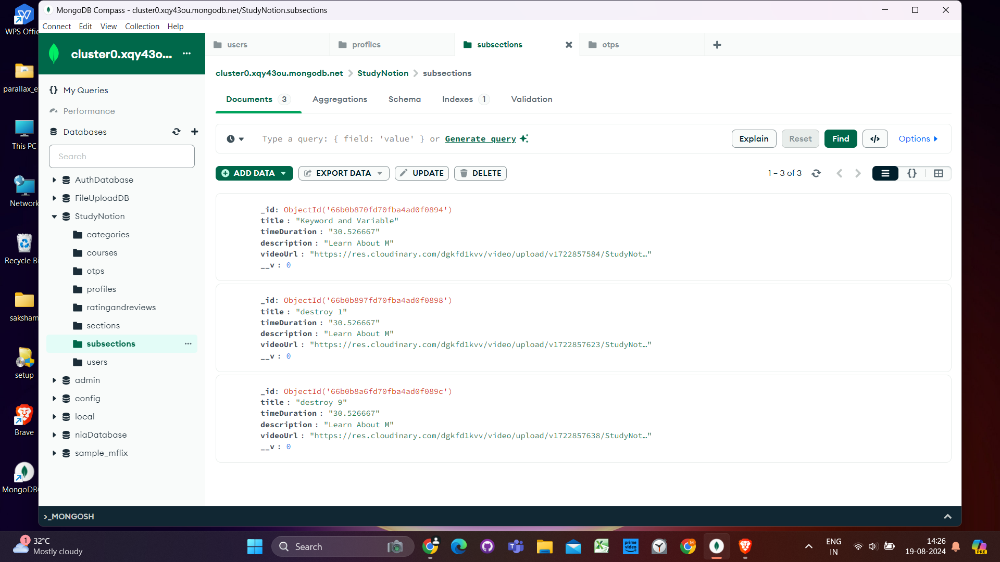

## API Design

### Authentication and User Management

- `POST /api/auth/forgot-password`: Send a password reset link.
- `POST /api/auth/verify-otp`: Verify OTP sent to the user's email.
- `POST /api/auth/signup`: Create a new user account.
- `POST /api/auth/login`: Log in and generate a JWT token.

### Course Management

- `GET /api/courses`: Get a list of all available courses.
- `GET /api/courses/:id`: Get details of a specific course.
- `POST /api/courses`: Create a new course.
- `PUT /api/courses/:id`: Update an existing course.
- `DELETE /api/courses/:id`: Delete a course.
- `POST /api/courses/:id/rate`: Add a course rating (out of 5).

### Example Responses

- `GET /api/courses`: Get all courses
  - **Response:** A list of all courses in the database.
  
- `GET /api/courses/:id`: Get a single course by ID
  - **Response:** The course with the specified ID.
  
- `POST /api/courses`: Create a new course
  - **Request:** The course details in the request body.
  - **Response:** The newly created course.
  
- `PUT /api/courses/:id`: Update an existing course by ID
  - **Request:** The updated course details in the request body.
  - **Response:** The updated course.
  
- `DELETE /api/courses/:id`: Delete a course by ID
  - **Response:** A success message indicating that the course has been deleted.

Thank you for checking out SkillUP!

