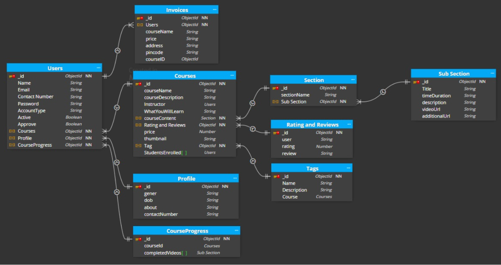

# SkillUP

## Installation
1. Clone the repository: `https://github.com/Mmehak-garg/SkillUpBAckend.git`
2. Navigate to the project directory: `cd `
3. Install dependencies: `npm install`
   
## Contributing
Contributions are welcome! If you have any suggestions or find any issues, please feel free to open an issue or a pull request.

## Project Description
Ed-tech platform that enables users to create, consume, and rate educational content. The platform is built using  NodeJS, MongoDB, and ExpressJS.

## System Architecture

The SkillUp EdTech platform consists of two main components: the back-end, and the database.

### Back-end
SkillUp uses a monolithic architecture, with the backend built using Node.js and Express.js, and MongoDB as the primary database.

- **User Authentication and Authorization:** Students and instructors can sign up and log in to the platform using their email addresses and passwords. The platform also supports OTP (One-Time Password) verification and forgot password functionality for added security.
- **Course Management:** Instructors can create, read, update, and delete courses, as well as manage course content and media. Students can view and rate courses.
- **Payment Integration:** Students will purchase and enroll in courses by completing the checkout flow, followed by Razorpay integration for payment handling.
- **Cloud-based Media Management:** StudyNotion uses Cloudinary, a cloud-based media management service, to store and manage all media content, including images, videos, and documents.
- **Markdown Formatting:** Course content in document format is stored in Markdown format, allowing for easier display and rendering on the front-end.

  

### Back-end Frameworks, Libraries, and Tools

The back-end of StudyNotion uses various frameworks, libraries, and tools to ensure its functionality and performance, including:

- **Node.js:** Used as the primary framework for the back-end.
- **Express.js:** Used as a web application framework, providing a range of features and tools for building web applications.
- **MongoDB:** Used as the primary database, providing a flexible and scalable data storage solution.
- **JWT (JSON Web Tokens):** Used for authentication and authorization, providing a secure and reliable way to manage user credentials.
- **Bcrypt:** Used for password hashing, adding an extra layer of security to user data.
- **Mongoose:** Used as an Object Data Modeling (ODM) library, providing a way to interact with MongoDB using JavaScript.
  

### Data Models and Database Schema

The back-end of StudyNotion uses several data models and database schemas to manage data, including:

- **Student Schema:** Includes fields such as name, email, password, and course details for each student.
- **Instructor Schema:** Includes fields such as name, email, password, and course details for each instructor.
- **Course Schema:** Includes fields such as course name, description, instructor details, and media content.

### Database

The database for the platform is built using MongoDB, a NoSQL database that provides a flexible and scalable data storage solution. MongoDB allows for the storage of unstructured and semi-structured data. The database stores the course content, user data, and other relevant information related to the platform.

### API Design

StudyNotion's API follows the REST architectural style, implemented using Node.js and Express.js. It uses JSON for data exchange and standard HTTP request methods. Sample API endpoints include:

- `POST /api/auth/signup`: Create a new user account.
- `POST /api/auth/login`: Log in and generate a JWT token.
- `POST /api/auth/verify-otp`: Verify OTP sent to the user's email.
- `POST /api/auth/forgot-password`: Send a password reset link.
- `GET /api/courses`: Get a list of all available courses.
- `GET /api/courses/:id`: Get details of a specific course.
- `POST /api/courses`: Create a new course.
- `PUT /api/courses/:id`: Update an existing course.
- `DELETE /api/courses/:id`: Delete a course.
- `POST /api/courses/:id/rate`: Add a course rating (out of 5).

Sample API requests and responses:
- `GET /api/courses`: Get all courses
- Response: A list of all courses in the database
- `GET /api/courses/:id`: Get a single course by ID
- Response: The course with the specified ID
- `POST /api/courses`: Create a new course
- Request: The course details in the request body
- Response: The newly created course
- `PUT /api/courses/:id`: Update an existing course by ID
- Request: The updated course details in the request body
- Response: The updated course
- `DELETE /api/courses/:id`: Delete a course by ID
- Response: A success message indicating that the course has been deleted.

[PostMan](https://study-notion-mega-project-frontend.vercel.app/)

Thank you

