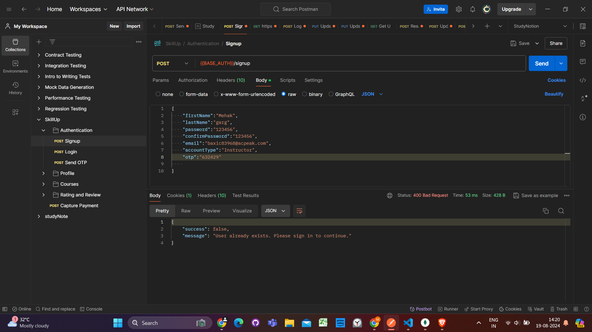

# SkillUP
## Project Description
Skill-up that enables users to create, consume, and rate educational content. The platform is built using  NodeJS, MongoDB, and ExpressJS.

It uses a monolithic architecture, with the backend built using Node.js and Express.js, and MongoDB as the primary database.

- **User Authentication and Authorization:** Students and instructors can sign up and log in to the platform using their email addresses and passwords. The platform also supports OTP (One-Time Password) verification and forgot password functionality for added security.
- **Course Management:** Instructors can create, read, update, and delete courses
- **Cloud-based Media Management:** StudyNotion uses Cloudinary, a cloud-based media management service, to store and manage all media content, including images, videos, and documents.
  
### Back-end Frameworks, Libraries, and Tools

- **Node.js:** Used as the primary framework for the back-end.
- **Express.js:** Used as a web application framework, providing a range of features and tools for building web applications.
- **MongoDB:** Used as the primary database, providing a flexible and scalable data storage solution.
- **JWT (JSON Web Tokens):** Used for authentication and authorization, providing a secure and reliable way to manage user credentials.
- **Bcrypt:** Used for password hashing, adding an extra layer of security to user data.
- **Mongoose:** Used as an Object Data Modeling (ODM) library, providing a way to interact with MongoDB using JavaScript.
  

### Data Models and Database Schema

- **Student Schema:** Includes fields such as name, email, password, and course details for each student.
- **Instructor Schema:** Includes fields such as name, email, password, and course details for each instructor.
- **Course Schema:** Includes fields such as course name, description, instructor details, and media content.

### Database

The database for the platform is built using MongoDB, a NoSQL database that provides a flexible and scalable data storage solution. MongoDB allows for the storage of unstructured and semi-structured data. The database stores the course content, user data, and other relevant information related to the platform.

### Screenshot

- `POST /api/auth/verify-otp`: Verify OTP sent to the user's email.
#### OTP Create

#### OTP Email

#### OTP Postman

#### Sign Up
- `POST /api/auth/signup`: Create a new user account.

#### User

#### Log In
- `POST /api/auth/login`: Log in and generate a JWT token.

#### Instructor

#### Token

#### Reset Password

#### Reset Email

#### User Entry

####category

#### Courses
- `POST /api/courses`: Create a new course.

#### Subsection

###  Some More API Design

- `POST /api/auth/forgot-password`: Send a password reset link.
- `GET /api/courses`: Get a list of all available courses.
- `GET /api/courses/:id`: Get details of a specific course.
- `PUT /api/courses/:id`: Update an existing course.
- `DELETE /api/courses/:id`: Delete a course.
- `POST /api/courses/:id/rate`: Add a course rating (out of 5).
- `GET /api/courses`: Get all courses
- Response: A list of all courses in the database
- `GET /api/courses/:id`: Get a single course by ID
- Response: The course with the specified ID
- `POST /api/courses`: Create a new course
- Request: The course details in the request body
- Response: The newly created course
- `PUT /api/courses/:id`: Update an existing course by ID
- Request: The updated course details in the request body
- Response: The updated course
- `DELETE /api/courses/:id`: Delete a course by ID
- Response: A success message indicating that the course has been deleted.

Thank you

